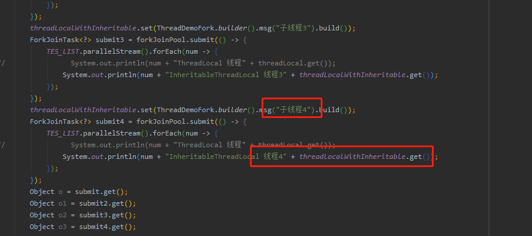

# parallelStream的TreadLocal线程传递

## 	一、parallelStream问题

​			ThreadLocal设计之初就是为了绑定当前线程，parallelStream在并行调用子线程时，无法获取主线程的ThreadLocal属性值，而是使用该线程默认的threadLocal值，所以我们需要更改ThreadLocal变量，让其能够在多线程间，由主线程传递至子线程中。

## 	二、InheritableThreadLocal 

```
/**
 * This class extends <tt>ThreadLocal</tt> to provide inheritance of values
 * from parent thread to child thread: when a child thread is created, the
 * child receives initial values for all inheritable thread-local variables
 * for which the parent has values.  Normally the child's values will be
 * identical to the parent's; however, the child's value can be made an
 * arbitrary function of the parent's by overriding the <tt>childValue</tt>
 * method in this class.
 *
 * <p>Inheritable thread-local variables are used in preference to
 * ordinary thread-local variables when the per-thread-attribute being
 * maintained in the variable (e.g., User ID, Transaction ID) must be
 * automatically transmitted to any child threads that are created.
 *
 * @author  Josh Bloch and Doug Lea
 * @see     ThreadLocal
 * @since   1.2
 */
 这个类扩展了ThreadLocal以提供值的继承

*从父线程到子线程:当一个子线程被创建时，

* child接收所有可继承线程局部变量的初始值

父元素具有值的。通常孩子的值是

*与父母的相同;然而，孩子的价值是可以被确定的

*通过覆盖子值来实现父函数的任意函数方法。

优先使用可继承线程局部变量

*普通线程局部变量时，每个线程属性

*维护的变量(如用户ID、事务ID)必须为

*自动传输到创建的任何子线程。
```

InheritableThreadLocal  重写了ThreadLocal 的 childValue，getMap，createMap 三个方法。

当Thread线程被创建时，调用Init方法，默认情况下，设置为threadLocal可传递

```dart
  /**
     * 初始化一个线程.
     * 此函数有两处调用，
     * 1、上面的 init()，不传AccessControlContext，inheritThreadLocals=true
     * 2、传递AccessControlContext，inheritThreadLocals=false
     */
    private void init(ThreadGroup g, Runnable target, String name,
                      long stackSize, AccessControlContext acc,
                      boolean inheritThreadLocals) {
        ......（其他代码）

        if (inheritThreadLocals && parent.inheritableThreadLocals != null)
            this.inheritableThreadLocals =
                ThreadLocal.createInheritedMap(parent.inheritableThreadLocals);

        ......（其他代码）
    }
```

当可传递标志为true并且父类线程不为空时，则将父线程InheritableThreadLocal  传递至子线程中

## 三、ThreadLocal.createInheritedMap

```cpp
 static ThreadLocalMap createInheritedMap(ThreadLocalMap parentMap) {
        return new ThreadLocalMap(parentMap);
    }
```

```csharp
/**
         * 构建一个包含所有parentMap中Inheritable ThreadLocals的ThreadLocalMap
         * 该函数只被 createInheritedMap() 调用.
         */
        private ThreadLocalMap(ThreadLocalMap parentMap) {
            Entry[] parentTable = parentMap.table;
            int len = parentTable.length;
            setThreshold(len);
            // ThreadLocalMap 使用 Entry[] table 存储ThreadLocal
            table = new Entry[len];

            // 逐一复制 parentMap 的记录
            for (int j = 0; j < len; j++) {
                Entry e = parentTable[j];
                if (e != null) {
                    @SuppressWarnings("unchecked")
                    ThreadLocal<Object> key = (ThreadLocal<Object>) e.get();
                    if (key != null) {
                        // 可能会有同学好奇此处为何使用childValue，而不是直接赋值，
                        // 毕竟childValue内部也是直接将e.value返回；
                        // 个人理解，主要为了减轻阅读代码的难度
                        Object value = key.childValue(e.value);
                        Entry c = new Entry(key, value);
                        int h = key.threadLocalHashCode & (len - 1);
                        while (table[h] != null)
                            h = nextIndex(h, len);
                        table[h] = c;
                        size++;
                    }
                }
            }
        }
```

## 四、问题

​	**线程池在使用的时候，例如上述代码中的submit操作，如果线程池内线程的数量小于开始设定的线程数量，则会把当前的任务作为第一个任务并创建新的线程去执行。所以上述代码中前两次使用线程池submit task的时候，变量分别传递成功。因为线程池的线程是主线程创建的子线程。而在submit task的时候，如果线程池中线程数量已经达到设定值，则不会创建线程，而是复用线程池中的线程，所以线程池中线程的本地变量也是复用的创建时设置的变量。因而出现后两次变量传递不成功的现象。**




**解决方案：**

引入阿里提供的技术：**TransmittableThreadLocal**

**github地址：**https://github.com/alibaba/transmittable-thread-local

用步骤：

​    **①：引入依赖包到pom文件中**     

```html
       <dependency>


          <groupId>com.alibaba</groupId>


          <artifactId>transmittable-thread-local</artifactId>


          <version>2.2.0</version>


       </dependency>
```

​    **②：修改代码使用新的线程本地变量**

​       

 

   **③： 根据官方给定的方式进行修饰，保证值的正确传递**

​        3.1 修饰`Runnable`和`Callable`

​        3.2 TtlExecutors 修饰线程池

`   `3.3 使用`Java Agent`来修饰`JDK`线程池实现类

​        本人使用的是方法2，直接对线程池进行修饰，便于集中管理. 详情可参考github文档描述.

​    

​     

 原问题解决作者：[TransmittableThreadLocal 解决线程本地变量在线程池之间的传递问题_代码小司机-CSDN博客_threadlocal线程池传递](https://blog.csdn.net/hewenbo111/article/details/90053105)